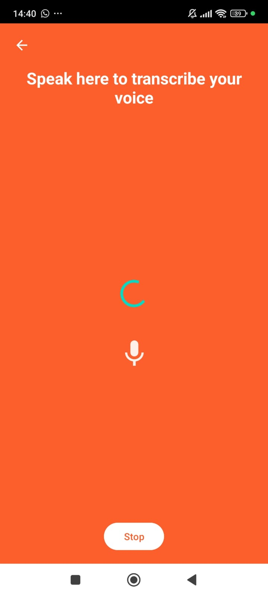
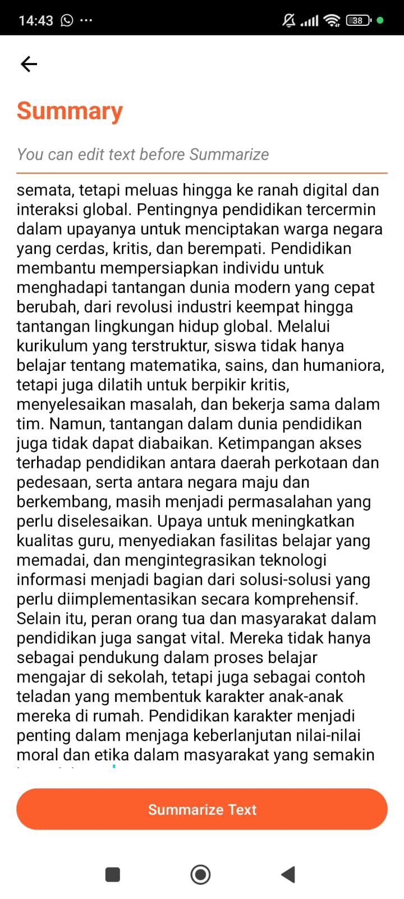
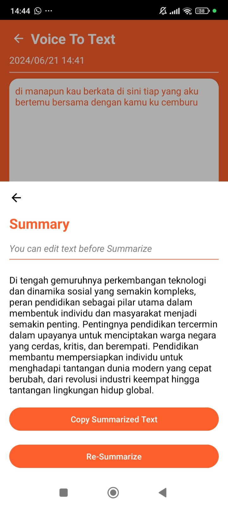

# C241-PS042-Capstone-Yap2Type

Organisasi ini adalah bagian dari Bangkit 2024 Product Capstone.

## About

Yap2Type adalah alat mutakhir yang dibuat untuk membantu pengguna merangkum konten berbasis audio seperti berita, podcast, konferensi, dan percakapan. Pengguna dapat merekam atau mengunggah file audio ke aplikasi, dan kecerdasan buatan digunakan untuk merangkum konten menjadi poin-poin penting yang jelas dan singkat. Pengguna dapat menghemat waktu dan usaha dengan menggunakan Yap2Type untuk dengan cepat mendapatkan gambaran dari percakapan atau diskusi tanpa harus mendengarkan rekaman lengkap lagi.

## Team Members

| Nama                   | ID Mahasiswa Bangkit | Role                |
|------------------------|----------------------|---------------------|
| Muhammad Irfan         | M132D4KY1867         | Machine Learning    |
| Akhmad Fadilla Akbar   | M119D4KY1765         | Machine Learning    |
| Farig Muhammad Taqy    | M132D4KY2015         | Machine Learning    |
| Arifin Mulqa Maulana   | C152D4KY0991         | Cloud Computing     |
| Puput Unggul Prayoga   | C152D4KY0148         | Cloud Computing     |
| Rahman Faisal          | A132D4KY4559         | Mobile Development  |
| Nabilla Zhavirah       | A573D4KX4374         | Mobile Development  |

## Mobile Development Documentation

### Features

There 3 main feature for now, among them :

1. Recording Video



2. Voice to Text


3. Summarize Text





### User Flow

## Cloud Computing Documentation

### API Speech to Text

In Yap2Type, the speech-to-text functionality is powered by a cloud computing service. Here is a step-by-step explanation of how the integration is achieved:

1. **Service Account Creation**:
   - First, a service account is created with the necessary permissions. The role chosen for the service account is `Service Account Admin`. This role allows managing and configuring the service account which will be used to authenticate and authorize API requests.

2. **Enable Speech-to-Text API**:
   - After creating the service account, the Speech-to-Text API is enabled. This involves going to the API services in the cloud platform and enabling the Speech-to-Text API.

3. **Authentication and API Usage**:
   - With the service account and the API enabled, an authentication token is generated which is used to authenticate API requests. The application then sends audio files to the API, which processes them and returns the transcribed text.

By leveraging cloud computing, Yap2Type can efficiently handle speech-to-text conversion, providing accurate and fast transcription services without requiring extensive local processing power.

### Deployment Requirements

Below is the `requirements.txt` file listing the necessary Python packages for Yap2Type:

```plaintext
Flask==3.0.3
flask-cors==4.0.1
tensorflow==2.16.1
tf-keras==2.16.0
transformers==4.41.2
Werkzeug==3.0.3
blinker==1.8.2
```

## Docker Configuration

### Docker Ignore File

Below is the `.dockerignore` file to exclude unnecessary files from the Docker build context:

```plaintext
__pycache__
*.pyc
*.pyo
*.pyd
.Python
env
build
dist
*.egg-info
```

### DOCKERFILE

```plaintext
FROM python:3.9-slim

WORKDIR /app

COPY requirements.txt .
RUN pip install sentencepiece \
    && pip install --no-cache-dir -r requirements.txt

COPY . .

EXPOSE 8080

ENV PORT 8080

CMD ["python", "main.py"]
```

## Deployed Cloud Run API Endpoint
To run the Yap2Type cloud run API with the `/summarize` endpoint, use the following URL:

```plaintext
https://summarizeapi-7c7o3mtyua-et.a.run.app/summarize
```
